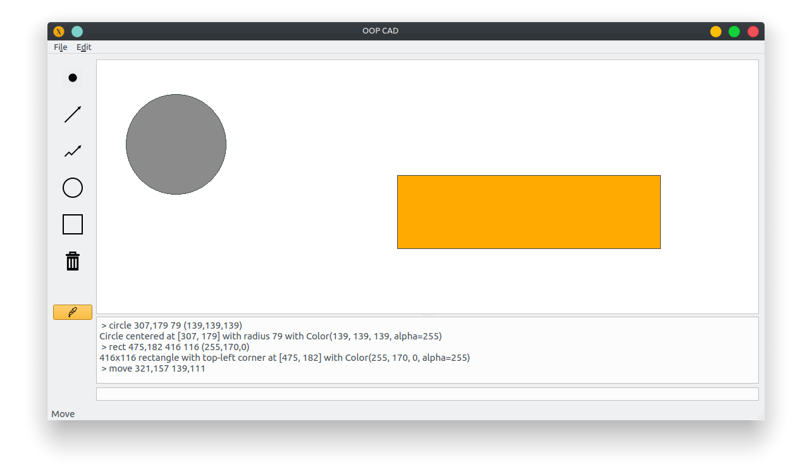

# CAD (Computer Aided Design)

This project aims for perfect and flawless object-oriented development. It's focused on using best practices, suitable design patterns, proper testing, and overall healthy code as it is a semestral project for an object-oriented programming course (BI-OOP) at FIT CTU.

The subject of this project is a simple version of Computer Aided Design (CAD).

## Tests

To run tests, just make sure you are inside the application's root directory and that you are working under your virtual environment (more about it in Documentation -> Installation). Then just run tests via:

```shell
pytest
```

## Documentation

### Installation

First, make sure you have Python 3 installed.

```shell
python3 --version
```

Create a virtual environment via `venv` (second *venv* is name of the folder with virtual environment):

```shell
python3 -m venv venv
```

Activate your virtual environment:

```shell
source venv/bin/activate
```

Upgrade pip to latest version and install all dependencies:

```shell
pip install --upgrade pip
pip install -r requirements.txt
```

Run the app:

```shell
./run.py
```

### Generating UI and/or resources

#### Resources

Run (from root folder):

```shell
pyrcc5 ./app/ui/resources.qrc -o ./app/ui/resources.py
```

#### UI

Run (from root folder):

```shell
pyuic5 ./app/ui/main_window.ui -o ./app/ui/main_window.py
```

and change `import resources_rc` (at the bottom of the file) to `import app.ui.resources`.

### Architecture

We have used Model-View-Presenter architecture, as it is used mostly for building UI apps.

As a model we use e.g. `ShapesStore` (`app/shapes_store.py`), shapes (`app/shapes.py`), commands (`app/commands.py`) and `CommandEngine` (`app/command_engine.py`).

As a presenter we use e.g. `MainWindow` (`app/gui.py`), `Controller` (`app/controller.py`) and brushes (`app/brushes.py`).

As a view we use e.g. `Canvas` (`app/canvas.py`) and `Printer` (`app/printers.py`) + generated files from UI designer (`app/ui`).

### Examples

The GUI of the app looks like this – on top there is the canvas, on the bottom is the command line interface.

On the left is located the command palete, which can be used by user to draw/remove shapes on canvas or to change the color.



### Assignment

The app provides GUI with following features:

* Command line interface
* History of all commands
* Drawing basic shapes (i.e. dots, lines, polylines, rectangles and circles)
* Shape preview while drawing
* Color choosing
* Moving and deleting shapes
* Undo and redo
* Saving and loading
* Output list of objects on some point (or on the whole canvas)

A user can interact with the application in two different ways - via command line interface (takes commands described below) or graphical user interface.

Above CLI is a history of all commands that have been executed (no matter whether they were created via CLI or GUI) and messages that these commands can produce. There's also a status bar in the left bottom corner indicating which action is currently selected and if the file is saved/loaded, a message will appear there as well.

The user can select an action via their icons. After choosing one, the action button will be highlighted, as well as there will be a name of the action in the status bar (bottom left corner). The default action is the move action (it means that if there's no action button pressed, the move action is active). Also, the color of the shape to be drawn can be changed after clicking on the color button (the last one in the left toolbar).

The mouse cursor is changing according to the action you're about to do:

* Crosshair if you are drawing a shape
* Pointing hand if you are deleting a shape or choosing a brush
* Open hand if you are choosing a shape to move
* Closed hand if you have already chosen a shape and you are choosing where to place it

Common key-shortcuts are also available (`ctrl+s`, `ctrl+l`, `ctrl+n`, `ctrl+w`, `ctrl+z`, `ctrl+shift+z`).

### Design patterns

In this section, we will describe some design patterns we have decided to use.

#### Polymorphism

To be able to not repeat our code, or create meaningless switches, we have used polymorphism for shapes (`app/shapes.py`), shape factories (`app/shape_factory_.py`), printers (`app/printers.py`), commands (`app/commands.py`) and brushes (`app/brushes.py`).

#### Double-dispatch

We call `shape.print_to(printer)` on given shape (first dispatch) and then call respective method for printing concrete shape on given printer (second dispatch), e.g. `app/shapes.py:53`.

#### Visitor pattern

We use this pattern for printers (`app/printers.py`), those are our visitors, and shapes (`app/shapes.py`) are objects being visited.

#### Factory pattern

To keep our code flexible and reusable, we use factory pattern (`app/shape_factory.py`) for shapes (`app/shapes.py`).

#### Observer pattern

Controller (`app/controller.py`) observes shapes store (`app/shape_store.py`).

#### Parser combinators

We use CLI parser (`app/parsers/cli_parser.py`) which is built from other, smaller parsers (e.g. `app/parsers/color_parser.py`) as input and properly parses the input data.

#### Strategy pattern

We use canvas brushes (`app/brushes.py`) as a strategy pattern.

#### Sigleton

Canvas brushes (`app/brushes.py`) are also singletons.
